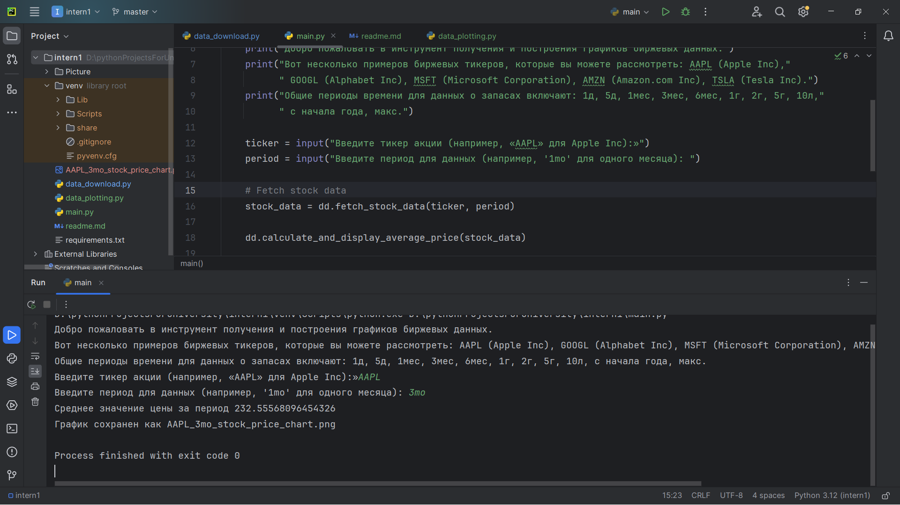

## Анализ и визуализация данных об акциях

### Этот проект предназначен для загрузки исторических данных об акциях и их визуализации. Он использует библиотеку yfinance для получения данных и matplotlib для создания графиков. Пользователи могут выбирать различные тикеры и временные периоды для анализа, а также просматривать движение цен и скользящие средние на графике.

### Структура и модули проекта:

#### 1. data_download.py:

- Отвечает за загрузку данных об акциях.

- Содержит функции для извлечения данных об акциях из интернета и расчёта скользящего среднего; функцию, которая вычисляет и выводит среднюю цену закрытия акций за заданный период; функцию, которая анализирует данные и уведомляет пользователя, если цена акций колебалась более чем на заданный процент за период.

#### 2. main.py:

- Является точкой входа в программу.

- Запрашивает у пользователя тикер акции и временной период, загружает данные, обрабатывает их и выводит результаты в виде графика.

#### 3. data_plotting.py:

- Отвечает за визуализацию данных.

- Содержит функции для создания и сохранения графиков цен закрытия и скользящих средних.

### Пошаговое использование программы:

1. Запустите main.py.

2. Введите интересующий вас тикер акции (например, 'AAPL' для Apple Inc).

3. Введите желаемый временной период для анализа (например, '1mo' для данных за один месяц).

4. Программа обработает введённые данные, загрузит соответствующие данные об акциях, рассчитает скользящее среднее и отобразит график.

5. Программа выводит среднюю цену закрытия акций за заданный период в консоль.

6. Программа запрашивает пороговый процент колебания цены акций за период, вычисляет максимальное и минимальное значения цены закрытия и сравнивает разницу с заданным порогом. Если разница превышает порог, пользователь получает уведомление.

